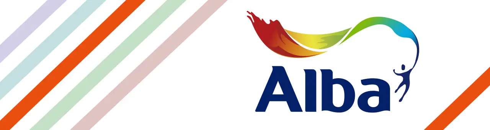

<html lang="es">
<head>
    <meta charset="UTF-8">
    <meta name="viewport" content="width=device-width, initial-scale=1.0">
    <title>Asesoramiento Experto en Insumos | Tu Socio Creativo</title>
    
    <link rel="preconnect" href="https://fonts.googleapis.com">
    <link rel="preconnect" href="https://fonts.gstatic.com" crossorigin>
    <link href="https://fonts.googleapis.com/css2?family=Inter:wght@400;600;700;800&display=swap" rel="stylesheet">
    
</head>
<body class="bg-mesh text-gray-900">

    <section class="relative pt-16 pb-20 lg:pt-24 lg:pb-32 overflow-hidden">
        

            

                

                    

                        
                        Acceso Mayorista Intermedio
                    

                    <h1 class="text-4xl md:text-6xl font-extrabold tracking-tight text-gray-900 leading-[1.1] mb-6">
                        Impulsá tu taller con precios directos y asesoría a medida
                    </h1>
                    

                        Dejá de pagar de más por tus insumos. Recibí una selección personalizada según tu producción y accedé a beneficios exclusivos que solo damos a emprendedores.
                    

                    

                        <a href="#formulario" class="w-full sm:w-auto px-8 py-5 bg-orange-500 text-white font-bold rounded-2xl cta-shadow transition-all text-lg text-center transform hover:-translate-y-1 uppercase tracking-tight">
                            Quiero mi selección personalizada
                            

    
    Acceso Mayorista Intermedio
    |
    Distribuidores Oficiales:
    

        
        
        
    

                        </a>
                        

                            Un asesor te contactará
                            Sin compromiso de compra
                        

                    

                

                

                    

                    
                

            

        

    </section>

    <section class="py-20 bg-gray-50/50 border-y border-gray-100">
        

            

                <h2 class="text-2xl font-bold text-gray-800 tracking-tight">Más de 500 emprendedores ya optimizaron sus costos</h2>
            

            

                

                    

                        <svg class="w-5 h-5 fill-current" viewBox="0 0 20 20"><path d="M9.049 2.927c.3-.921 1.603-.921 1.902 0l1.07 3.292a1 1 0 00.95.69h3.462c.969 0 1.371 1.24.588 1.81l-2.8 2.034a1 1 0 00-.364 1.118l1.07 3.292c.3.921-.755 1.688-1.54 1.118l-2.8-2.034a1 1 0 00-1.175 0l-2.8 2.034c-.784.57-1.838-.197-1.539-1.118l1.07-3.292a1 1 0 00-.364-1.118L2.98 8.72c-.783-.57-.38-1.81.588-1.81h3.461a1 1 0 00.951-.69l1.07-3.292z"/></svg>
                        <svg class="w-5 h-5 fill-current" viewBox="0 0 20 20"><path d="M9.049 2.927c.3-.921 1.603-.921 1.902 0l1.07 3.292a1 1 0 00.95.69h3.462c.969 0 1.371 1.24.588 1.81l-2.8 2.034a1 1 0 00-.364 1.118l1.07 3.292c.3.921-.755 1.688-1.54 1.118l-2.8-2.034a1 1 0 00-1.175 0l-2.8 2.034c-.784.57-1.838-.197-1.539-1.118l1.07-3.292a1 1 0 00-.364-1.118L2.98 8.72c-.783-.57-.38-1.81.588-1.81h3.461a1 1 0 00.951-.69l1.07-3.292z"/></svg>
                        <svg class="w-5 h-5 fill-current" viewBox="0 0 20 20"><path d="M9.049 2.927c.3-.921 1.603-.921 1.902 0l1.07 3.292a1 1 0 00.95.69h3.462c.969 0 1.371 1.24.588 1.81l-2.8 2.034a1 1 0 00-.364 1.118l1.07 3.292c.3.921-.755 1.688-1.54 1.118l-2.8-2.034a1 1 0 00-1.175 0l-2.8 2.034c-.784.57-1.838-.197-1.539-1.118l1.07-3.292a1 1 0 00-.364-1.118L2.98 8.72c-.783-.57-.38-1.81.588-1.81h3.461a1 1 0 00.951-.69l1.07-3.292z"/></svg>
                        <svg class="w-5 h-5 fill-current" viewBox="0 0 20 20"><path d="M9.049 2.927c.3-.921 1.603-.921 1.902 0l1.07 3.292a1 1 0 00.95.69h3.462c.969 0 1.371 1.24.588 1.81l-2.8 2.034a1 1 0 00-.364 1.118l1.07 3.292c.3.921-.755 1.688-1.54 1.118l-2.8-2.034a1 1 0 00-1.175 0l-2.8 2.034c-.784.57-1.838-.197-1.539-1.118l1.07-3.292a1 1 0 00-.364-1.118L2.98 8.72c-.783-.57-.38-1.81.588-1.81h3.461a1 1 0 00.951-.69l1.07-3.292z"/></svg>
                        <svg class="w-5 h-5 fill-current" viewBox="0 0 20 20"><path d="M9.049 2.927c.3-.921 1.603-.921 1.902 0l1.07 3.292a1 1 0 00.95.69h3.462c.969 0 1.371 1.24.588 1.81l-2.8 2.034a1 1 0 00-.364 1.118l1.07 3.292c.3.921-.755 1.688-1.54 1.118l-2.8-2.034a1 1 0 00-1.175 0l-2.8 2.034c-.784.57-1.838-.197-1.539-1.118l1.07-3.292a1 1 0 00-.364-1.118L2.98 8.72c-.783-.57-.38-1.81.588-1.81h3.461a1 1 0 00.951-.69l1.07-3.292z"/></svg>
                    

                    
"Increíble el ahorro. Compraba por unidad y ahora con el asesoramiento puedo planificar mis compras del mes. El descuento en el primer pedido fue real."

                    

                        
LC

                        

                            
Lucía C.

                            
Taller de Cerámica

                        

                    

                

                

                    

                        <svg class="w-5 h-5 fill-current" viewBox="0 0 20 20"><path d="M9.049 2.927c.3-.921 1.603-.921 1.902 0l1.07 3.292a1 1 0 00.95.69h3.462c.969 0 1.371 1.24.588 1.81l-2.8 2.034a1 1 0 00-.364 1.118l1.07 3.292c.3.921-.755 1.688-1.54 1.118l-2.8-2.034a1 1 0 00-1.175 0l-2.8 2.034c-.784.57-1.838-.197-1.539-1.118l1.07-3.292a1 1 0 00-.364-1.118L2.98 8.72c-.783-.57-.38-1.81.588-1.81h3.461a1 1 0 00.951-.69l1.07-3.292z"/></svg>
                        <svg class="w-5 h-5 fill-current" viewBox="0 0 20 20"><path d="M9.049 2.927c.3-.921 1.603-.921 1.902 0l1.07 3.292a1 1 0 00.95.69h3.462c.969 0 1.371 1.24.588 1.81l-2.8 2.034a1 1 0 00-.364 1.118l1.07 3.292c.3.921-.755 1.688-1.54 1.118l-2.8-2.034a1 1 0 00-1.175 0l-2.8 2.034c-.784.57-1.838-.197-1.539-1.118l1.07-3.292a1 1 0 00-.364-1.118L2.98 8.72c-.783-.57-.38-1.81.588-1.81h3.461a1 1 0 00.951-.69l1.07-3.292z"/></svg>
                        <svg class="w-5 h-5 fill-current" viewBox="0 0 20 20"><path d="M9.049 2.927c.3-.921 1.603-.921 1.902 0l1.07 3.292a1 1 0 00.95.69h3.462c.969 0 1.371 1.24.588 1.81l-2.8 2.034a1 1 0 00-.364 1.118l1.07 3.292c.3.921-.755 1.688-1.54 1.118l-2.8-2.034a1 1 0 00-1.175 0l-2.8 2.034c-.784.57-1.838-.197-1.539-1.118l1.07-3.292a1 1 0 00-.364-1.118L2.98 8.72c-.783-.57-.38-1.81.588-1.81h3.461a1 1 0 00.951-.69l1.07-3.292z"/></svg>
                        <svg class="w-5 h-5 fill-current" viewBox="0 0 20 20"><path d="M9.049 2.927c.3-.921 1.603-.921 1.902 0l1.07 3.292a1 1 0 00.95.69h3.462c.969 0 1.371 1.24.588 1.81l-2.8 2.034a1 1 0 00-.364 1.118l1.07 3.292c.3.921-.755 1.688-1.54 1.118l-2.8-2.034a1 1 0 00-1.175 0l-2.8 2.034c-.784.57-1.838-.197-1.539-1.118l1.07-3.292a1 1 0 00-.364-1.118L2.98 8.72c-.783-.57-.38-1.81.588-1.81h3.461a1 1 0 00.951-.69l1.07-3.292z"/></svg>
                        <svg class="w-5 h-5 fill-current" viewBox="0 0 20 20"><path d="M9.049 2.927c.3-.921 1.603-.921 1.902 0l1.07 3.292a1 1 0 00.95.69h3.462c.969 0 1.371 1.24.588 1.81l-2.8 2.034a1 1 0 00-.364 1.118l1.07 3.292c.3.921-.755 1.688-1.54 1.118l-2.8-2.034a1 1 0 00-1.175 0l-2.8 2.034c-.784.57-1.838-.197-1.539-1.118l1.07-3.292a1 1 0 00-.364-1.118L2.98 8.72c-.783-.57-.38-1.81.588-1.81h3.461a1 1 0 00.951-.69l1.07-3.292z"/></svg>
                    

                    
"No entendía nada de resina y el asesor me guió paso a paso. Ahora compro en cantidad y mis márgenes son otros. Súper recomendado."

                    

                        
JA

                        

                            
Julián A.

                            
Artesanías en Resina

                        

                    

                

                

                    

                        <svg class="w-5 h-5 fill-current" viewBox="0 0 20 20"><path d="M9.049 2.927c.3-.921 1.603-.921 1.902 0l1.07 3.292a1 1 0 00.95.69h3.462c.969 0 1.371 1.24.588 1.81l-2.8 2.034a1 1 0 00-.364 1.118l1.07 3.292c.3.921-.755 1.688-1.54 1.118l-2.8-2.034a1 1 0 00-1.175 0l-2.8 2.034c-.784.57-1.838-.197-1.539-1.118l1.07-3.292a1 1 0 00-.364-1.118L2.98 8.72c-.783-.57-.38-1.81.588-1.81h3.461a1 1 0 00.951-.69l1.07-3.292z"/></svg>
                        <svg class="w-5 h-5 fill-current" viewBox="0 0 20 20"><path d="M9.049 2.927c.3-.921 1.603-.921 1.902 0l1.07 3.292a1 1 0 00.95.69h3.462c.969 0 1.371 1.24.588 1.81l-2.8 2.034a1 1 0 00-.364 1.118l1.07 3.292c.3.921-.755 1.688-1.54 1.118l-2.8-2.034a1 1 0 00-1.175 0l-2.8 2.034c-.784.57-1.838-.197-1.539-1.118l1.07-3.292a1 1 0 00-.364-1.118L2.98 8.72c-.783-.57-.38-1.81.588-1.81h3.461a1 1 0 00.951-.69l1.07-3.292z"/></svg>
                        <svg class="w-5 h-5 fill-current" viewBox="0 0 20 20"><path d="M9.049 2.927c.3-.921 1.603-.921 1.902 0l1.07 3.292a1 1 0 00.95.69h3.462c.969 0 1.371 1.24.588 1.81l-2.8 2.034a1 1 0 00-.364 1.118l1.07 3.292c.3.921-.755 1.688-1.54 1.118l-2.8-2.034a1 1 0 00-1.175 0l-2.8 2.034c-.784.57-1.838-.197-1.539-1.118l1.07-3.292a1 1 0 00-.364-1.118L2.98 8.72c-.783-.57-.38-1.81.588-1.81h3.461a1 1 0 00.951-.69l1.07-3.292z"/></svg>
                        <svg class="w-5 h-5 fill-current" viewBox="0 0 20 20"><path d="M9.049 2.927c.3-.921 1.603-.921 1.902 0l1.07 3.292a1 1 0 00.95.69h3.462c.969 0 1.371 1.24.588 1.81l-2.8 2.034a1 1 0 00-.364 1.118l1.07 3.292c.3.921-.755 1.688-1.54 1.118l-2.8-2.034a1 1 0 00-1.175 0l-2.8 2.034c-.784.57-1.838-.197-1.539-1.118l1.07-3.292a1 1 0 00-.364-1.118L2.98 8.72c-.783-.57-.38-1.81.588-1.81h3.461a1 1 0 00.951-.69l1.07-3.292z"/></svg>
                        <svg class="w-5 h-5 fill-current" viewBox="0 0 20 20"><path d="M9.049 2.927c.3-.921 1.603-.921 1.902 0l1.07 3.292a1 1 0 00.95.69h3.462c.969 0 1.371 1.24.588 1.81l-2.8 2.034a1 1 0 00-.364 1.118l1.07 3.292c.3.921-.755 1.688-1.54 1.118l-2.8-2.034a1 1 0 00-1.175 0l-2.8 2.034c-.784.57-1.838-.197-1.539-1.118l1.07-3.292a1 1 0 00-.364-1.118L2.98 8.72c-.783-.57-.38-1.81.588-1.81h3.461a1 1 0 00.951-.69l1.07-3.292z"/></svg>
                    

                    
"Lo mejor es la velocidad de respuesta. Me armaron una lista ideal para mi nivel de producción y me ahorraron horas de búsqueda."

                    

                        
MM

                        

                            
Mariana M.

                            
Pintura Decorativa

                        

                    

                

            

        

    </section>

    <section class="py-20 bg-white">
        

            

                <h2 class="text-3xl font-extrabold text-gray-900">¿Sentís que podrías producir más si tus insumos fueran más económicos?</h2>
                
Nuestra propuesta es para vos si:

            

            

                

                    
1

                    
Sos tallerista y los costos de materiales afectan la rentabilidad de tus clases.

                

                

                    
2

                    
Comprás con regularidad pero no llegás a los mínimos de una distribuidora gigante.

                

                

                    
3

                    
Necesitás asesoramiento técnico sobre qué marcas rinden más para tu técnica específica.

                

            

        

    </section>

    <section id="formulario" class="py-24 bg-gray-50">
        

            

                
                

                    <h3 class="text-2xl font-bold mb-6 italic" id="sidebar-title">Solo 30 segundos...</h3>
                    

                        

                            
<svg class="w-5 h-5" fill="none" stroke="currentColor" viewBox="0 0 24 24"><path stroke-linecap="round" stroke-linejoin="round" stroke-width="2" d="M5 13l4 4L19 7"></path></svg>

                            Sin compromiso
                        

                        

                            
<svg class="w-5 h-5" fill="none" stroke="currentColor" viewBox="0 0 24 24"><path stroke-linecap="round" stroke-linejoin="round" stroke-width="2" d="M13 10V3L4 14h7v7l9-11h-7z"></path></svg>

                            Respuesta rápida
                        

                        

                            
<svg class="w-5 h-5" fill="none" stroke="currentColor" viewBox="0 0 24 24"><path stroke-linecap="round" stroke-linejoin="round" stroke-width="2" d="M8 7V3m8 4V3m-9 8h10M5 21h14a2 2 0 002-2V7a2 2 0 00-2-2H5a2 2 0 00-2 2v12a2 2 0 002 2z"></path></svg>

                            Asesoría 1:1
                        

                    

                    

                        
Seleccioná un horario disponible para que un experto te llame y analicen juntos tu lista de insumos.

                        

                            Duración
                            
10-15 Minutos

                        

                    

                

                

                    
                    <form id="leadForm" action="https://formsubmit.co/ajax/onalldigitalworks@gmail.com" method="POST" class="space-y-5">
                        <input type="hidden" name="_captcha" value="false">
                        <input type="hidden" name="_subject" value="Nueva Solicitud de Insumos">
                        
                        

                            

                                <label class="block text-xs font-bold uppercase tracking-widest text-gray-400 mb-2">Nombre Completo</label>
                                <input type="text" name="Nombre" id="form-name" required class="form-input w-full px-5 py-4 rounded-xl bg-gray-50 border border-gray-100 outline-none" placeholder="Tu nombre">
                            

                            

                                <label class="block text-xs font-bold uppercase tracking-widest text-gray-400 mb-2">WhatsApp</label>
                                <input type="tel" name="WhatsApp" id="form-whatsapp" required class="form-input w-full px-5 py-4 rounded-xl bg-gray-50 border border-gray-100 outline-none" placeholder="+54 9 ...">
                            

                        

                        

                            <label class="block text-xs font-bold uppercase tracking-widest text-gray-400 mb-2">¿A qué técnica te dedicás?</label>
                            <input type="text" name="Tecnica" id="form-tecnica" required class="form-input w-full px-5 py-4 rounded-xl bg-gray-50 border border-gray-100 outline-none" placeholder="Ej: Pintura decorativa, Porcelana, Resina...">
                        

                        

                            

                                <label class="block text-xs font-bold uppercase tracking-widest text-gray-400 mb-2">Insumo que más usás</label>
                                <input type="text" name="Insumo_Principal" id="form-insumo" required class="form-input w-full px-5 py-4 rounded-xl bg-gray-50 border border-gray-100 outline-none" placeholder="Ej: Acrílicos, Pinceles...">
                            

                            

                                <label class="block text-xs font-bold uppercase tracking-widest text-gray-400 mb-2">Volumen de compra</label>
                                <select name="Volumen" id="form-volumen" required class="form-input w-full px-5 py-4 rounded-xl bg-gray-50 border border-gray-100 outline-none appearance-none">
                                    <option value="" disabled selected>Seleccioná una opción</option>
                                    <option value="bajo">Bajo (Uso personal)</option>
                                    <option value="medio">Medio (Emprendedor/Tallerista)</option>
                                    <option value="alto">Alto (Producción masiva/Revendedor)</option>
                                </select>
                            

                        

                        

                            <button type="submit" id="submitBtn" class="w-full py-5 bg-orange-500 hover:bg-orange-600 text-white font-extrabold rounded-2xl transition-all shadow-xl text-lg uppercase tracking-tight">
                                Quiero mi selección personalizada
                            </button>
                        

                    </form>

                    

                        

                            <svg class="w-8 h-8" fill="none" stroke="currentColor" viewBox="0 0 24 24"><path stroke-linecap="round" stroke-linejoin="round" stroke-width="2" d="M5 13l4 4L19 7"></path></svg>
                        

                        <h3 class="text-3xl font-black mb-2">¡Casi listo!</h3>
                        
Un asesor te contactará pronto. Pero si querés asegurar tus beneficios ahora:

                        
                        

                            <h4 class="text-xl font-bold text-orange-900 mb-3">¿Querés avanzar más rápido?</h4>
                            
Elegí el horario que mejor te quede para recibir tu asesoría personalizada hoy.

                            
                            <button onclick="showAgenda()" class="w-full py-4 bg-gray-900 hover:bg-black text-white font-bold rounded-xl transition-all text-lg shadow-lg">
                                Agendar llamada con prioridad
                            </button>
                            
                            

                                <svg class="w-4 h-4 animate-pulse" fill="currentColor" viewBox="0 0 20 20"><path d="M10 18a8 8 0 100-16 8 8 0 000 16zm1-12a1 1 0 10-2 0v4a1 1 0 00.293.707l2.828 2.829a1 1 0 101.415-1.415L11 9.586V6z"></path></svg>
                                Cupos limitados
                            

                        

                    

                    

                        

                            <h3 class="text-2xl font-black mb-1">Elegí tu horario</h3>
                            
Llamadas disponibles de Lunes a Viernes

                        

                        
                        

                            <button class="flex-1 min-w-[80px] py-3 rounded-xl border border-gray-200 bg-white hover:border-orange-500 transition-all focus:border-orange-500 focus:bg-orange-50 group">
                                Lun
                                21
                            </button>
                            <button class="flex-1 min-w-[80px] py-3 rounded-xl border border-gray-200 bg-white hover:border-orange-500 transition-all focus:border-orange-500 focus:bg-orange-50 group">
                                Mar
                                22
                            </button>
                            <button class="flex-1 min-w-[80px] py-3 rounded-xl border-orange-500 bg-orange-50 group">
                                Mié
                                23
                            </button>
                            <button class="flex-1 min-w-[80px] py-3 rounded-xl border border-gray-200 bg-white hover:border-orange-500 transition-all focus:border-orange-500 focus:bg-orange-50 group">
                                Jue
                                24
                            </button>
                            <button class="flex-1 min-w-[80px] py-3 rounded-xl border border-gray-200 bg-white hover:border-orange-500 transition-all focus:border-orange-500 focus:bg-orange-50 group">
                                Vie
                                25
                            </button>
                        

                        

                            <button onclick="selectSlot(this)" class="time-slot py-3 border border-gray-100 rounded-xl text-sm font-bold bg-gray-50 transition-all">09:00 AM</button>
                            <button onclick="selectSlot(this)" class="time-slot py-3 border border-gray-100 rounded-xl text-sm font-bold bg-gray-50 transition-all">10:30 AM</button>
                            <button onclick="selectSlot(this)" class="time-slot py-3 border border-gray-100 rounded-xl text-sm font-bold bg-gray-50 transition-all">11:45 AM</button>
                            <button onclick="selectSlot(this)" class="time-slot py-3 border border-gray-100 rounded-xl text-sm font-bold bg-gray-50 transition-all">02:00 PM</button>
                            <button onclick="selectSlot(this)" class="time-slot py-3 border border-gray-100 rounded-xl text-sm font-bold bg-gray-50 transition-all">04:30 PM</button>
                            <button onclick="selectSlot(this)" class="time-slot py-3 border border-gray-100 rounded-xl text-sm font-bold bg-gray-50 transition-all">05:45 PM</button>
                        

                        <button id="confirmAgenda" disabled class="w-full py-5 bg-orange-500 disabled:bg-gray-200 disabled:cursor-not-allowed text-white font-extrabold rounded-2xl transition-all shadow-xl text-lg uppercase">
                            Confirmar Agendamiento
                        </button>
                    

                    

                        

                            <svg class="w-10 h-10" fill="none" stroke="currentColor" viewBox="0 0 24 24"><path stroke-linecap="round" stroke-linejoin="round" stroke-width="2" d="M12 8v4l3 3m6-3a9 9 0 11-18 0 9 9 0 0118 0z"></path></svg>
                        

                        <h3 class="text-3xl font-black mb-2">¡Turno Reservado!</h3>
                        
Agendamos tu llamada para el Miércoles 23 a las --:--.

                        

                            Recibirás un recordatorio por WhatsApp 15 minutos antes de la llamada. ¡Prepará tu lista de dudas!
                        

                    

                

            

        

    </section>

    <footer class="py-12 text-center text-gray-400 text-sm">
        
&copy; 2024 Nuestra Artística - Al servicio de la creatividad.

    </footer>

    
</body>
</html>
